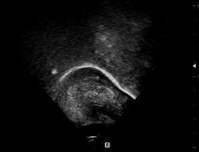

## AN AUDIO-TEXTUAL DIFFUSION MODEL FOR CONVERTING SPEECH SIGNALS INTO ULTRASOUND TONGUE IMAGING DATA

Acoustic-to-articulatory inversion (AAI) is to convert audio into articulator movements, such as ultrasound tongue imaging (UTI) data. An issue of existing AAI methods is only using the personalized acoustic information to derive the general patterns of tongue motions, and thus the quality of generated UTI data is limited. To address this issue, this paper proposes an audio-textual diffusion model for the UTI data generation task. In this model, the inherent acoustic characteristics of individuals related to the tongue motion details are encoded by using wav2vec 2.0, while the ASR transcriptions related to the universality of tongue motions are encoded by using BERT. UTI data are then generated by using a diffusion module. Experimental results showed that the proposed diffusion model could generate high-quality UTI data with clear tongue contour that is crucial for the linguistic analysis and clinical assessment.	

in this paper, All of our metrics are SOTA！

## DATASET preprocess for Ultrasound  😀

Our ultrasound data mainly consist of parallel ultrasound and speech data, for which we perform the following preprocessing steps:

(1) Ultrasound duration check   (2) Ultrasound video check   (3) Audio-ultrasound data registration

The frame rate of ultrasound collection is 60fps. The checks involve manual and code-based screenings. The code is located under Utils. The ultrasound data used has been processed and does not require secondary preprocessing.

## Acquire the DATASET 😀!

Our ultrasound data is collected from Shenzhen, China. It includes 44 healthy adults, and the database size is continuously expanding. Currently, the database has a size of 6.89 hours, comprising approximately 7000 ultrasound files, including 21 males and 23 females. For more details regarding the usage of the database, you can click on this link to apply: 

The data collection has undergone ethical review and obtained informed consent from the participants, considering the ethical and privacy concerns of the subjects involved. Please refrain from unauthorized dissemination to protect the privacy of the participants.

Sample：




## Infer Config 

- To setup this repository, first clone it and cd into it

  ```
  git clone https://github.com/yangyudong2020/Wav2uti.git
  cd Wav2uti
  ```

- Setup a new conda env: 

  ```
  conda create -n wav2uti python=3.10 -y
  conda activate echodiff
  ```

- Yours Datasets

```
Dataset
├───Ultrasound
│   ├───ult
│   │   |   video001.ult
│   │   │   video002.ult
│   │   │   video003.ult
│   │   │   ...
│   └───wav
│   │   |   wav001.wav
│   │   │   wav002.wav
│   │   │   wav003.wav
│   │   │   ...
```

We will publicly release our complete inference methods and training process after the review is completed. Currently, we are providing the testing process.

```shell
pip install -r requestments.txt
./ init.sh
```

Prepare your pre-trained weight code. We follow the setups of Bert and Wav2Vec2.0, available on Hugging Face 🤗 here: [Wav2Vec2.0](https://huggingface.co/jonatasgrosman/wav2vec2-large-xlsr-53-chinese-zh-cn) and [Bert](https://huggingface.co/bert-base-chinese).

We need to use these two pre-trained weights and extract personalized speech information and universal speech information.

To proceed with the subsequent training, the following parameters need to be passed:

| Config             | Is_True?            |
| ------------------ | ------------------- |
| --dataset_path     | True                |
| --image_sizes      | True                |
| --embed_dim        | True                |
| --num_sample_steps | True                |
| --sigma_min        | False defalut 0.001 |
| --sigma_max        | False defalut 160   |
| --sigma_data       | False defalut 0.25  |
| --rho              | False defalut 7     |
| Pmean              | False defalut -1.2  |
| Pstd               | False defalut 1.2   |
| Schurn             | False defalut 80    |
| Stmin              | False defalut 0.05  |
| Stmax              | False defalut 50    |
| Snoise             | False defalut 1.003 |

Test：

```shell
python infer.py --dataset_path=path --image_sizes=112 --embed_dim=256 --num_sample_steps=16
```

## Evaluation Metrics 

In this paper, The Metrics is RMSE、LPIPS、FID and PSNR

Evaluation Metrics code path in evaluation/

FID evaluation work by stylegan-v

fellow this tree:

```
MODEL Output
├───Ultrasound
│   ├───images
│   │   ├───real
│   │   │   ├───video001
│   │   │   │   image001.jpg
│   │   │   │   image002.jpg
│   │   │   ...
│   │   └───fake
│   │       ├───video001
│   │       │   image001.jpg
│   │       │   image002.jpg
│   │       ...
│   └───videos
│       video001.gif
│       video002.gif
│       ...
```

This will populate the  folder with the frames of the videos. Now you can run the FID metric computation with:


```
cd stylegan-v
python src/scripts/calc_metrics_for_dataset.py --real_data_path path/to/images/real --fake_data_path path/to/images/fake --mirror 0 --gpus 1 --resolution 128 --metrics fid50k_full
```


## Citation

```
Underviewer
```


